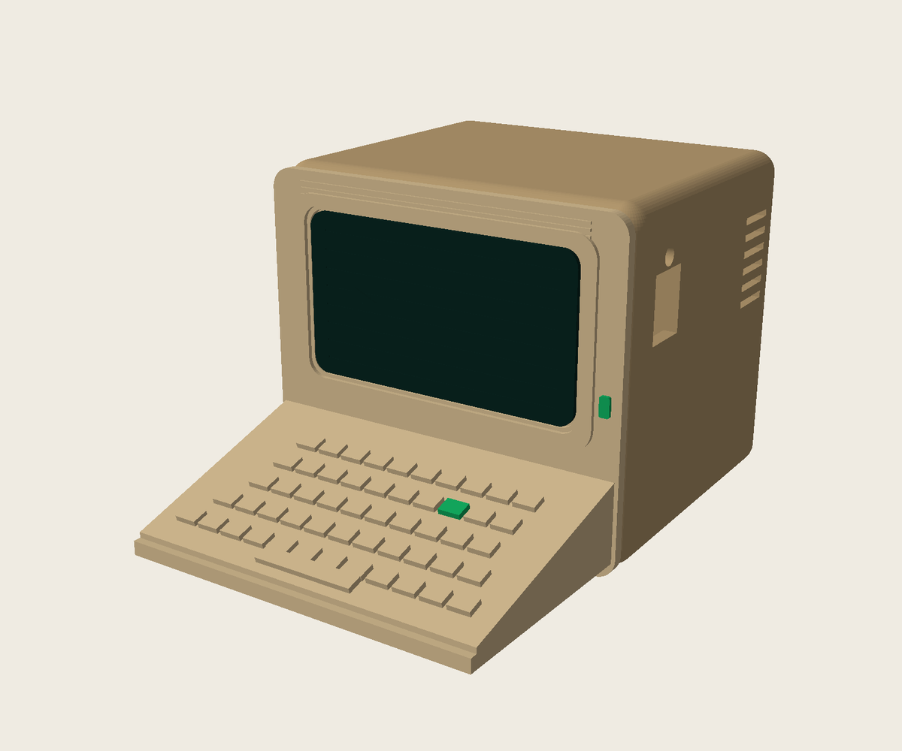
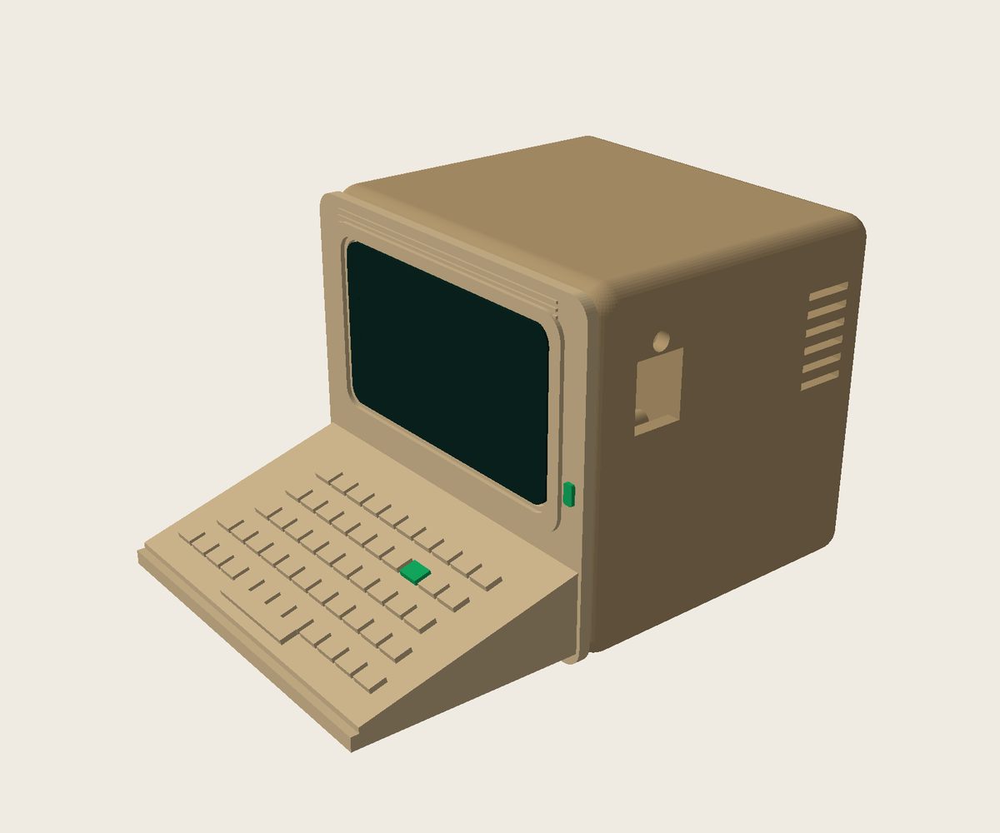
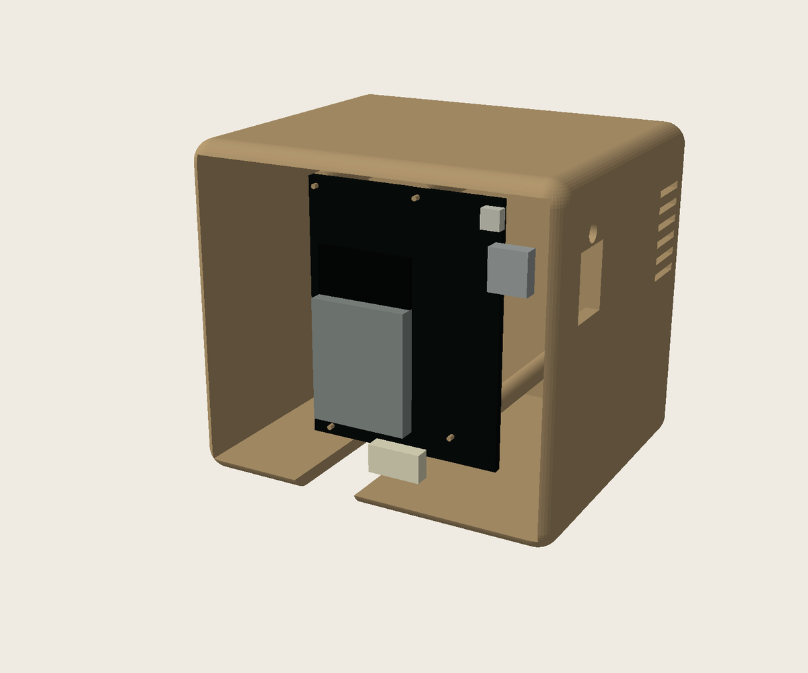
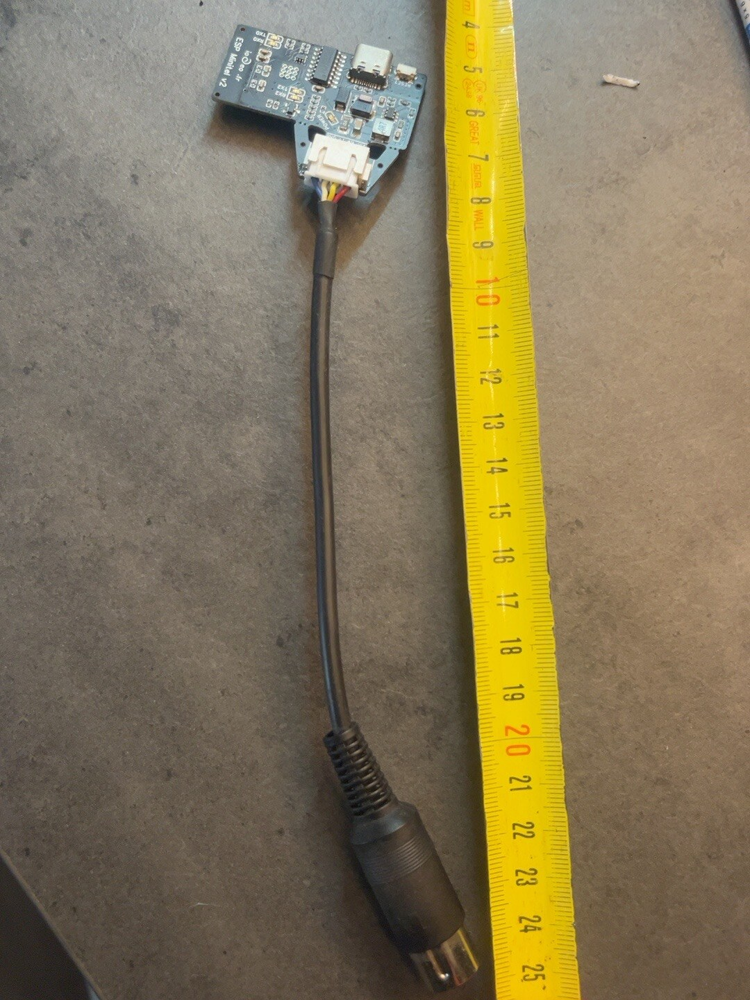
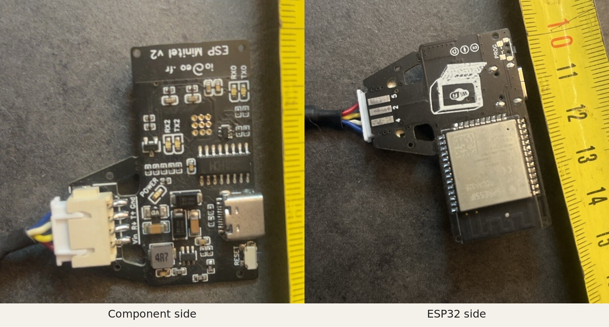

# Mini Minitel ESP32 case


A small, printable Minitel-shaped enclosure for the
[iodeo ESP Minitel V2](https://github.com/iodeo/Minitel-ESP32) board with the
JST cable-to-DIN connector.

The v0.2 test model deliberately follows the project avatar: a rounded CRT
cabinet, recessed dark screen, top ribs, open sloping keyboard, green Enter key
and status light, and cabinet vents on the right side.







The ESP32 PCB is mounted vertically behind the faux screen. The JST lead exits
through the bottom. USB-C has its own plug-sized side opening and RESET has a
separate protected pinhole. The DIN connector and cable stay outside the
enclosure, so the case does not hang directly from the Minitel port.

## Target hardware

The enclosure targets this JST cable variant. The ruler is included in the
photographs as a practical size reference.





> [!WARNING]
> The first physical **v0.2** fit test found that the PCB locating pins do not
> align reliably with the real JST-board and that the fixed USB-C opening cannot
> be reached in the intended centred position. Do not force the PCB and do not
> start a new v0.2 body print. The already printed body is being retained as the
> basis for a corrective clip-in carrier and a support-light inset front.

The first v0.3 compatibility parts are documented in
[`V0.3-COMPAT-DESIGN.md`](V0.3-COMPAT-DESIGN.md). They reuse an existing v0.2
body, shift the PCB on a separate edge cradle, split the front into a shallow
inset lid and removable keyboard, and replace the reset pinhole with a retained
external push button. Treat all v0.3 meshes as fit-test parts until verified on
the physical print.


## Features

- Parametric OpenSCAD source
- Approximately 68 × 60 × 58 mm body, rebuilt from real Minitel proportions
- Rounded CRT bezel and screen insert, top cabinet ribs and side vents
- Sloping open keyboard with a pronounced front lip
- Separate green Enter-key/status-light accent part
- Four PCB locating pins based on the official drill coordinates
- Bottom cable exit
- Separate USB-C opening with clearance for a moulded plug
- Protected RESET pinhole for a paperclip or thin tool
- Simplified printable keyboard and raised terminal-prompt detail
- Two hardware reference images, including a front/back close-up

## Repository layout

```text
minitel_esp32_case.scad       Parametric source model
minitel_v03_compat.scad       Corrective parts for an existing v0.2 body
minitel_*_v0.3-test.stl       Unverified carrier/lid/keyboard/reset test parts
minitel_*_v0.2.stl           Current ready-to-test meshes
minitel_*_v0.1.stl           Archived first prototype meshes
preview-v0.2.png              Current three-quarter right-front hero render
preview-side-v0.2.png         Elevated right-front functional render
preview-mounting-v0.2.png     Open-front PCB mounting-intent render
preview-v0.3-compat.png        Corrective carrier and shifted-PCB render
preview-reset-v0.3.png         Protruding reset-button close-up
V0.3-COMPAT-DESIGN.md         v0.3 recovery design and test order
preview.png                   Archived v0.1 front preview
preview-side.png              Archived v0.1 side preview
project-avatar.png            Square transparent project avatar
hardware-overview.jpg         Complete cable and DIN connector
pcb-closeups.jpg              Both PCB sides in one image
LICENSE                       CC BY-SA 4.0 license
```

The v0.2 assembly STL is intended for inspection only. Print the four individual
parts instead. The tiny accent STL is best assigned to green filament as a
multi-part object in OrcaSlicer; it may be omitted for a single-colour print.

## Physical v0.2 fit result

The body-only test was completed on a Creality K2. These checks remain useful
for diagnosing the corrective carrier, but v0.2 should no longer be treated as
a ready-to-print release:

1. Check that the four 0.90 mm locating pins enter the PCB holes.
2. Confirm that no rear-side component touches a support post.
3. Route the JST cable freely through the bottom opening.
4. Insert a USB-C plug fully and confirm that it does not lever against the case.
5. Confirm that RESET can be pressed through its pinhole with a thin tool.

The official drill file specifies nominal 1.143 mm holes and the locating pins
are 0.90 mm. The mismatch is positional rather than a tight-hole problem. Keep
an existing v0.2 body intact until the replacement carrier has been test-fitted.

## Suggested print settings

The model was designed for a Creality K2 with a 0.4 mm nozzle, but it does not
depend on a K2-specific feature.

| Setting | Recommendation |
| --- | --- |
| Material | PLA |
| Layer height | 0.20 mm |
| Walls | 3 |
| Top/bottom layers | 4 |
| Infill | 15% gyroid |
| Supports | Off for body/screen; build-plate-only where needed for front |
| Outer-wall speed | 60–80 mm/s for clean small lettering |

Print the body with its rear surface on the build plate and the cavity facing
up. Print the screen flat. The front may be printed on its side with a brim, or
with the visible side upward and build-plate-only supports beneath the keyboard
deck and rear pins.

## Assembly

1. Remove strings and verify all openings.
2. Place the PCB with the JST connector facing down and USB-C towards the side
   service opening.
3. Guide the cable through the bottom slot.
4. Test the front on the four friction pins. Sand them lightly if needed.
5. Press the screen into its shallow seat. Add a tiny amount of glue only after
   the fit is confirmed.

Only after the body passes this test should you print the v0.2 front, screen
and accent parts.

Classic colours are beige for the body/front and dark green or black for the
screen. The screen is a separate part, so a multi-material system is optional.
The raised terminal prompt can be colour-painted in the slicer.

## Editing and exporting

Open `minitel_esp32_case.scad` in OpenSCAD and select `body`, `front`,
`screen`, `accent` or `assembly` using the `part` parameter. Important
dimensions and fit parameters are grouped at the top of the file.

Increase `fit_clearance` in 0.10 mm steps if the front fixing pins are too
tight. The USB-C and RESET coordinates and opening sizes are also grouped at
the top of the source for easy adjustment after the first body-only fit test.
Do not alter the PCB dimensions until the Gerber dimensions have been compared
with a caliper measurement.

## Attribution and license

Mechanical dimensions were derived from the ESP Minitel V2 open-hardware files
by Louis H./iodeo:

- <https://github.com/iodeo/Minitel-ESP32>
- <https://hackaday.io/project/180473-minitel-esp32>

The upstream hardware is published under CC BY-SA 4.0. This derivative case is
therefore also licensed under the
[Creative Commons Attribution-ShareAlike 4.0 International License](LICENSE).

Contributions and real-world fit reports are welcome.

## Version history

- **v0.2 failed fit prototype:** authentic deeper cabinet proportions and a
  much longer fold-down keyboard; physical testing exposed PCB-mount and
  service-opening alignment errors. Existing bodies are candidates for the
  planned corrective carrier and inset front.
- **v0.1 experimental prototype:** first PCB-mounting proof of concept; kept in
  the repository for comparison.
