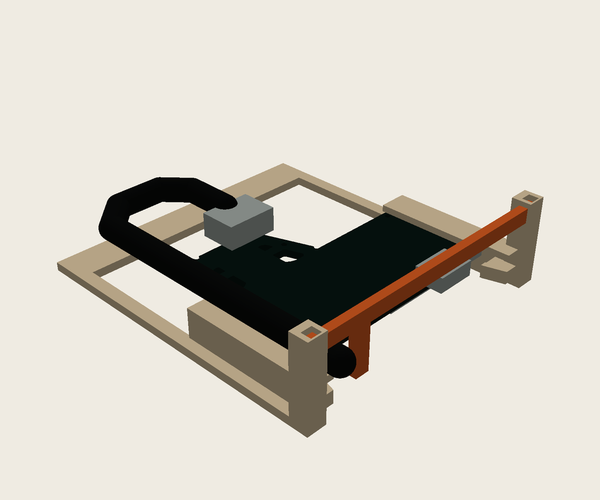
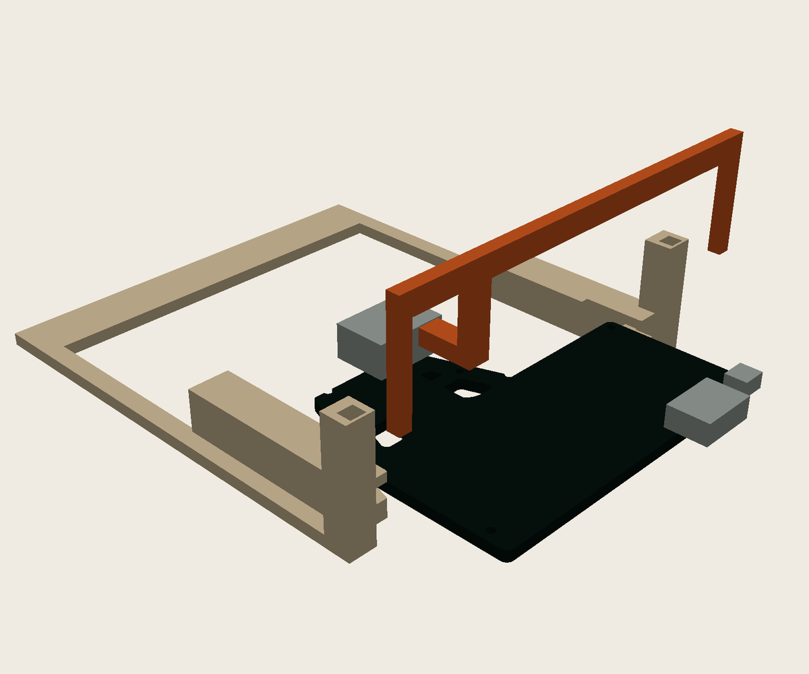
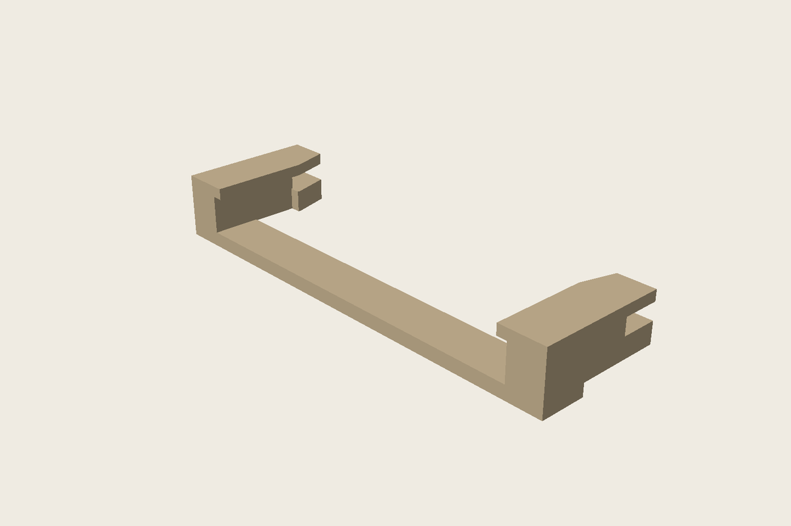

# Mini Minitel ESP32 case

A printable Minitel-shaped enclosure for the
[iodeo ESP Minitel V2](https://github.com/iodeo/Minitel-ESP32) JST cable-to-DIN board.

## Latest: v0.5 rear-bay fit test

v0.5 tests the replacement mounting architecture for the populated JST board:
the connected PCB slides directly into two edge guides, the cable makes a
60 mm relaxed turn and returns above the right guide, and a removable rear
retainer prevents the board from sliding back. There is no snap-on PCB plate.

Print the small guide coupon first on a Creality K2 with a 0.4 mm nozzle and
0.20 mm layers. If that fits, print the open bay and retainer. The full
Minitel-shaped body will be regenerated only after this physical fit gate.

- [Small guide coupon STL — print this first](stl/v0.5/minitel_guide_coupon_v0.5-test.stl)
- [Complete open rear-bay test STL](stl/v0.5/minitel_rear_bay_v0.5-test.stl)
- [Rear retainer STL](stl/v0.5/minitel_rear_retainer_v0.5-test.stl)
- [Measurements, K2 settings and test procedure](docs/V0.5-FIT-TEST.md)
- [Editable OpenSCAD source](src/minitel_v05_fit_test.scad)

The first render shows the final routed position. The second shows the populated
PCB partway through the checked rear insertion path with the retainer lifted.

> [!IMPORTANT]
> This is a fit fixture, not the complete enclosure. The exact Gerber board and
> measured 10.4 mm populated height clear the modelled insertion route, but the
> physical K2 coupon decides the final guide tolerance. Do not force the PCB.

## Rejected v0.4 donor-cassette prototype

The official iodeo cassette sits horizontally at the bottom, with its original
end cap at the lower rear. The fixed Minitel front and keyboard form one body.
This requires a new body print; it is not an upgrade for the printed v0.2 body.

> [!WARNING]
> **Superseded after physical testing.** The donor cassette is for another board
> configuration and is too narrow, shallow and low for this populated JST
> board. Keep these files for design history; do not print them for this board.

- [Assembly STL for inspection](archive/v0.4/stl/minitel_assembly_v0.4-review.stl)
- [Body STL](archive/v0.4/stl/minitel_body_v0.4-review.stl)
- [Original cap, positioned at rear](archive/v0.4/stl/minitel_cover_v0.4-review.stl)
- [Design, validation results and rebuild commands](archive/v0.4/V0.4-PROTOTYPE.md)
- [Editable OpenSCAD source](archive/v0.4/src/minitel_v04.scad)

Actual exported meshes; cap shown 14 mm rearward in the second view.

## Historical v0.3 test

The experimental parts aim to reuse an already printed v0.2 body: a separate
PCB carrier, inset lid, removable keyboard and protruding reset plunger.
See [design and test notes](archive/v0.3/V0.3-COMPAT-DESIGN.md).

For a v0.3 carrier fit test, print
[`archive/v0.3/stl/minitel_carrier_v0.3-test.stl`](archive/v0.3/stl/minitel_carrier_v0.3-test.stl)
only. Keep the already printed v0.2 body.

> [!WARNING]
> Physical fit is not verified yet. The PCB in the renders uses the exact v2.2
> Gerber outline, cut-outs and mounting holes, but omits electronic components.
> USB-C clearance, reset operation and clip force still need checking on the
> real board. Keep the existing v0.2 body and do not force any snap feature.

## Assembly and carrier renders

Actual v0.3 meshes, viewed from the front-right. The complete exterior includes
the retained v0.2 body and its screen/accent inserts. Electronic components are
omitted, so the USB opening and reset cap still need a physical alignment test.

The replacement carrier follows the routed PCB perimeter and uses all five
Gerber mounting holes as locating points. The four round sockets fit the
unchanged v0.2 body pins. Two compliant hooks retain the top and bottom board
edges; the right edge remains clear for USB-C and RESET.

The seated and exploded views use the outline, four internal cutouts and five
mounting holes extracted from iodeo's v2.2 Gerbers. They match the characteristic
shape in the
[upstream 3D view](https://github.com/iodeo/Minitel-ESP32/blob/39c49b8462b46dfb7da84c08aecdd48e5c52a224/hardware/ESP%20Minitel%20Devboard%20-%203d%20view.png).
It is a bare-board geometric reference, not a complete electronic assembly.

With the lid removed, the carrier and bare-board reference sit inside the
unchanged v0.2 body as follows:

See [reference provenance and limitations](docs/PCB-REFERENCE.md). The previous
rectangular-cradle content of `preview-v0.3-compat.png` was replaced when this
unprinted v0.3 design was revised.

## Repository layout

- [`src/`](src/): editable OpenSCAD sources.
- [`stl/v0.5/`](stl/v0.5/): current guide coupon, rear-bay fixture and retainer.
- [`docs/`](docs/): design notes and PCB-reference provenance.
- [`assets/renders/`](assets/renders/): current CAD renders.
- [`assets/photos/`](assets/photos/): owner-supplied hardware photographs.
- [`reference/`](reference/): PCB inspection mesh and unchanged iodeo donor STLs.
- [`tools/`](tools/): Gerber extraction and software-render scripts.
- [`archive/`](archive/): superseded v0.1 through v0.4 source, meshes and renders.

## Older versions

- [v0.1](archive/v0.1/): first prototype STLs and previews.
- [v0.2](archive/v0.2/): historical STLs, previews, source and documentation.
  The physical fit test exposed mounting problems; this is not a verified release.
- [v0.3](archive/v0.3/): attempted v0.2-compatible carrier and lid.
- [v0.4](archive/v0.4/): rejected donor-cassette prototype for another board layout.

The v0.3 source imports `archive/v0.2/minitel_esp32_case.scad`.
Keep that directory when downloading the project. Archiving does not change
the geometry or the already printed v0.2 body.

## Editing and exporting

Open [`src/minitel_v05_fit_test.scad`](src/minitel_v05_fit_test.scad) in
OpenSCAD and select `fixture`, `coupon`, `retainer` or `assembly` with the
`part` parameter. See the v0.5 design notes for reproducible export and
clearance-check commands.

## Attribution and license

Hardware reference: [Louis H./iodeo](https://github.com/iodeo/Minitel-ESP32)
and [Hackaday project](https://hackaday.io/project/180473-minitel-esp32).
This derivative case is licensed under [CC BY-SA 4.0](LICENSE).
Contributions and measured fit reports are welcome.
