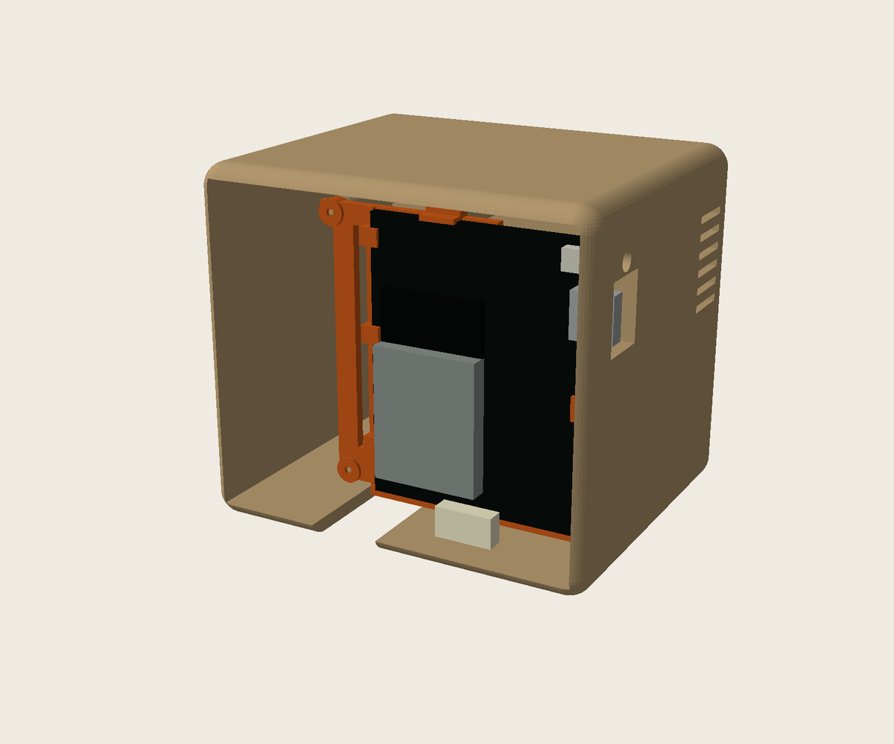
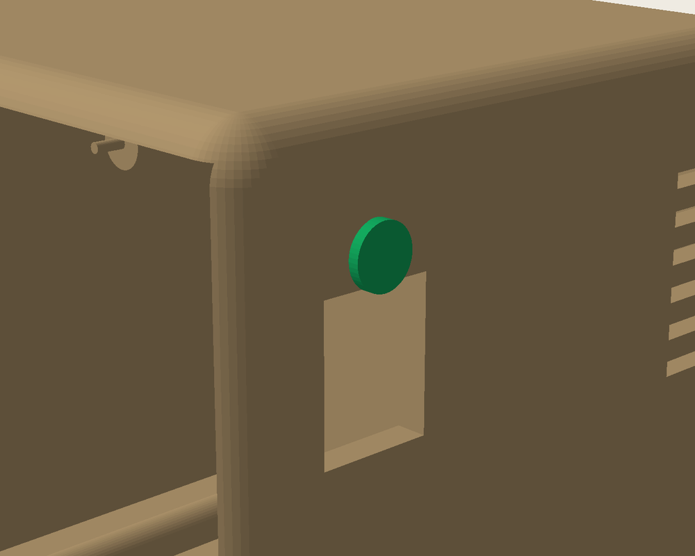

# Mini Minitel ESP32 case

A printable Minitel-shaped enclosure for the
[iodeo ESP Minitel V2](https://github.com/iodeo/Minitel-ESP32) JST cable-to-DIN board.

## Current version: v0.3 test

The experimental parts aim to reuse an already printed v0.2 body: a separate
PCB carrier, inset lid, removable keyboard and protruding reset plunger.
See [design and test notes](V0.3-COMPAT-DESIGN.md).

> [!WARNING]
> Fit is not verified. The PCB in the renders is a simplified mock-up, not an
> exact model. The carrier, mounting positions, USB-C clearance and reset
> operation need checking against the actual PCB before another print.
> Keep the existing v0.2 body; do not force the board into it.

## Current files

- `minitel_v03_compat.scad`: experimental source.
- `minitel_*_v0.3-test.stl`: carrier, lid, keyboard, reset plunger and assembly.
  The assembly is for inspection, not a single printable part.
- `render_preview.py`: preview generator; historical previews stay in the archive.
- [Hardware overview](hardware-overview.jpg) and [PCB close-ups](pcb-closeups.jpg).

## Older versions

- [v0.1](archive/v0.1/): first prototype STLs and previews.
- [v0.2](archive/v0.2/): historical STLs, previews, source and documentation.
  The physical fit test exposed mounting problems; this is not a verified release.

The v0.3 source imports `archive/v0.2/minitel_esp32_case.scad`.
Keep that directory when downloading the project. Archiving does not change
the geometry or the already printed v0.2 body.

## Editing and exporting

Open `minitel_v03_compat.scad` in OpenSCAD and select `carrier`, `lid`,
`keyboard`, `reset` or `assembly` with the `part` parameter.

## Attribution and license

Hardware reference: [Louis H./iodeo](https://github.com/iodeo/Minitel-ESP32)
and [Hackaday project](https://hackaday.io/project/180473-minitel-esp32).
This derivative case is licensed under [CC BY-SA 4.0](LICENSE).
Contributions and measured fit reports are welcome.
