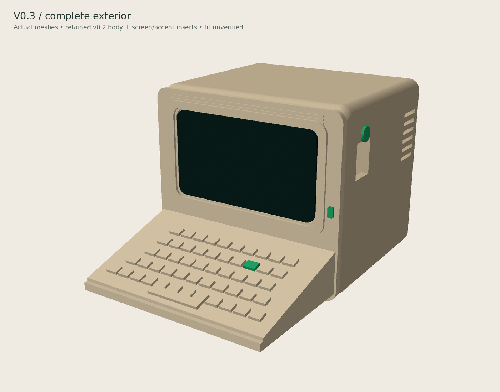
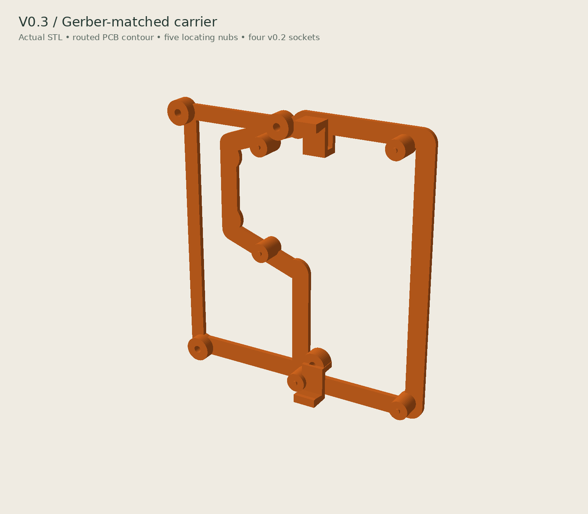
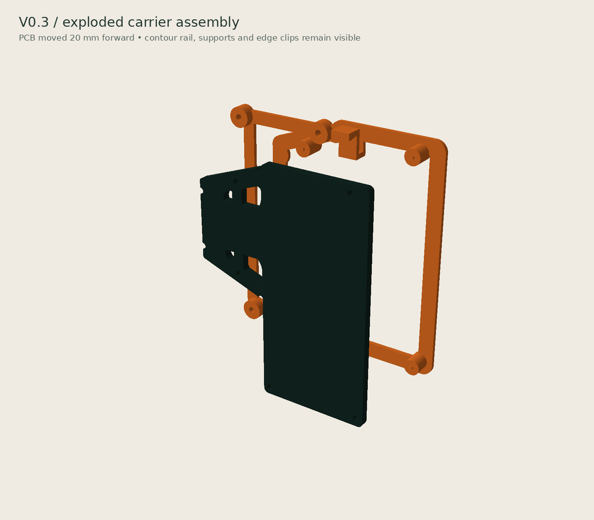

# Mini Minitel ESP32 case

A printable Minitel-shaped enclosure for the
[iodeo ESP Minitel V2](https://github.com/iodeo/Minitel-ESP32) JST cable-to-DIN board.

## Current version: v0.3 test

The experimental parts aim to reuse an already printed v0.2 body: a separate
PCB carrier, inset lid, removable keyboard and protruding reset plunger.
See [design and test notes](docs/V0.3-COMPAT-DESIGN.md).

For the next fit test, print
[`stl/v0.3/minitel_carrier_v0.3-test.stl`](stl/v0.3/minitel_carrier_v0.3-test.stl)
only. Keep the already printed v0.2 body.

> [!WARNING]
> Physical fit is not verified yet. The PCB in the renders uses the exact v2.2
> Gerber outline, cut-outs and mounting holes, but omits electronic components.
> USB-C clearance, reset operation and clip force still need checking on the
> real board. Keep the existing v0.2 body and do not force any snap feature.

## Assembly and carrier renders

Actual v0.3 meshes, viewed from the front-right. The complete exterior includes
the retained v0.2 body and its screen/accent inserts. Electronic components are
omitted, so the USB opening and reset cap still need a physical alignment test.

The replacement carrier follows the routed PCB perimeter and uses all five
Gerber mounting holes as locating points. The four round sockets fit the
unchanged v0.2 body pins. Two compliant hooks retain the top and bottom board
edges; the right edge remains clear for USB-C and RESET.

The seated and exploded views use the outline, four internal cutouts and five
mounting holes extracted from iodeo's v2.2 Gerbers. They match the characteristic
shape in the
[upstream 3D view](https://github.com/iodeo/Minitel-ESP32/blob/39c49b8462b46dfb7da84c08aecdd48e5c52a224/hardware/ESP%20Minitel%20Devboard%20-%203d%20view.png).
It is a bare-board geometric reference, not a complete electronic assembly.

With the lid removed, the carrier and bare-board reference sit inside the
unchanged v0.2 body as follows:

See [reference provenance and limitations](docs/PCB-REFERENCE.md). The previous
rectangular-cradle content of `preview-v0.3-compat.png` was replaced when this
unprinted v0.3 design was revised.

## Repository layout

- [`src/`](src/): editable OpenSCAD sources.
- [`stl/v0.3/`](stl/v0.3/): current printable test parts. The assembly STL is
  for inspection, not a single printable part.
- [`docs/`](docs/): design notes and PCB-reference provenance.
- [`assets/renders/v0.3/`](assets/renders/v0.3/): current README renders.
- [`assets/photos/`](assets/photos/): owner-supplied hardware photographs.
- [`reference/`](reference/): non-printable PCB inspection mesh.
- [`tools/`](tools/): Gerber extraction and software-render scripts.
- [`archive/`](archive/): frozen v0.1 and v0.2 files.

## Older versions

- [v0.1](archive/v0.1/): first prototype STLs and previews.
- [v0.2](archive/v0.2/): historical STLs, previews, source and documentation.
  The physical fit test exposed mounting problems; this is not a verified release.

The v0.3 source imports `archive/v0.2/minitel_esp32_case.scad`.
Keep that directory when downloading the project. Archiving does not change
the geometry or the already printed v0.2 body.

## Editing and exporting

Open [`src/minitel_v03_compat.scad`](src/minitel_v03_compat.scad) in OpenSCAD
and select `carrier`, `lid`,
`keyboard`, `reset` or `assembly` with the `part` parameter.

## Attribution and license

Hardware reference: [Louis H./iodeo](https://github.com/iodeo/Minitel-ESP32)
and [Hackaday project](https://hackaday.io/project/180473-minitel-esp32).
This derivative case is licensed under [CC BY-SA 4.0](LICENSE).
Contributions and measured fit reports are welcome.
