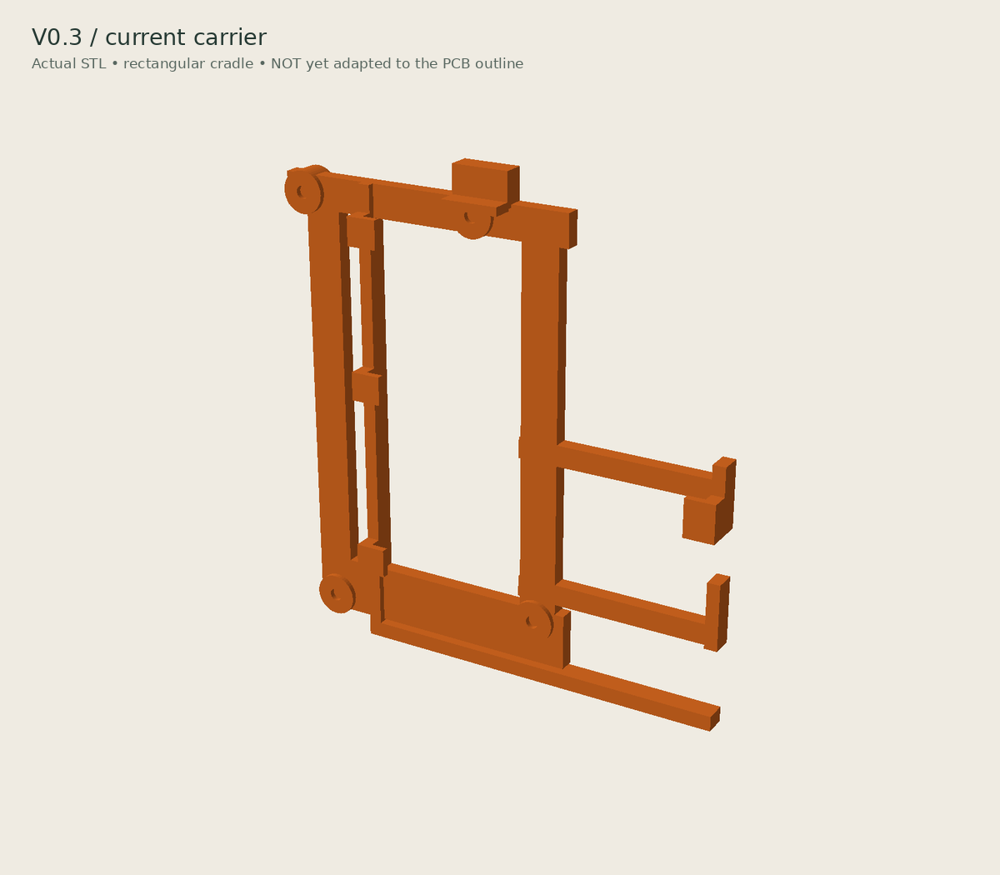
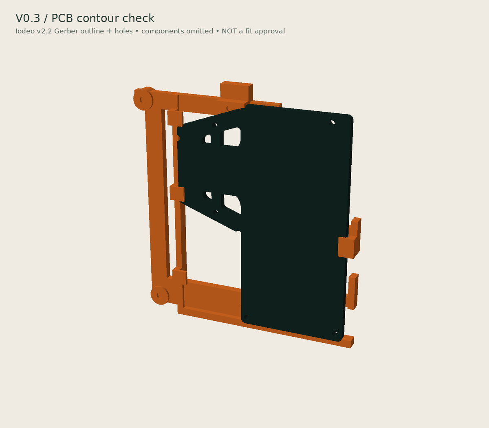
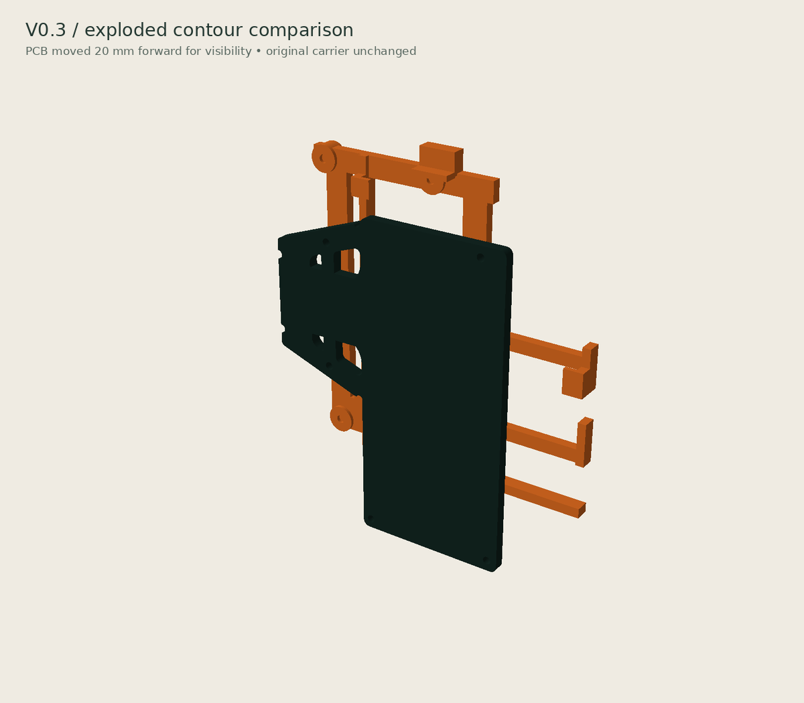

# Mini Minitel ESP32 case

A printable Minitel-shaped enclosure for the
[iodeo ESP Minitel V2](https://github.com/iodeo/Minitel-ESP32) JST cable-to-DIN board.

## Current version: v0.3 test

The experimental parts aim to reuse an already printed v0.2 body: a separate
PCB carrier, inset lid, removable keyboard and protruding reset plunger.
See [design and test notes](V0.3-COMPAT-DESIGN.md).

> [!WARNING]
> Fit is not verified. The PCB in the renders is a simplified mock-up, not an
> exact model. The carrier, mounting positions, USB-C clearance and reset
> operation need checking against the actual PCB before another print.
> Keep the existing v0.2 body; do not force the board into it.

## Assembly and carrier renders

Actual v0.3 meshes, viewed from the front-right. The complete exterior includes
the retained v0.2 body and its screen/accent inserts. Electronic components are
omitted: the USB opening and reset cap shown here do not establish alignment.

The current carrier STL is shown unchanged below. **It does not follow the real
PCB contour yet:** the lower left clip is outside the narrow main PCB section,
and the top latch is over the sloping shoulder rather than the top board edge.
Do not print this carrier as a confirmed correction.

This comparison replaces the old rectangular PCB mock-up with the outline,
four internal cutouts and five mounting holes extracted from iodeo's v2.2
Gerbers. It matches the characteristic shape in the
[upstream 3D view](https://github.com/iodeo/Minitel-ESP32/blob/39c49b8462b46dfb7da84c08aecdd48e5c52a224/hardware/ESP%20Minitel%20Devboard%20-%203d%20view.png).
It is a bare-board geometric reference, not a complete electronic assembly.

See [reference provenance and limitations](PCB-REFERENCE.md). The old
`preview-v0.3-compat.png` uses a rectangular mock-up and is superseded by these
comparisons.

## Current files

- `minitel_v03_compat.scad`: experimental source.
- `minitel_*_v0.3-test.stl`: carrier, lid, keyboard, reset plunger and assembly.
  The assembly is for inspection, not a single printable part.
- `render_preview.py`: preview generator; historical previews stay in the archive.
- `render_v03_readme.py`: current assembly and carrier comparison renders.
- `pcb_reference.scad` / `pcb_reference.stl`: bare PCB reference only, not print parts.
- [Hardware overview](hardware-overview.jpg) and [PCB close-ups](pcb-closeups.jpg).

## Older versions

- [v0.1](archive/v0.1/): first prototype STLs and previews.
- [v0.2](archive/v0.2/): historical STLs, previews, source and documentation.
  The physical fit test exposed mounting problems; this is not a verified release.

The v0.3 source imports `archive/v0.2/minitel_esp32_case.scad`.
Keep that directory when downloading the project. Archiving does not change
the geometry or the already printed v0.2 body.

## Editing and exporting

Open `minitel_v03_compat.scad` in OpenSCAD and select `carrier`, `lid`,
`keyboard`, `reset` or `assembly` with the `part` parameter.

## Attribution and license

Hardware reference: [Louis H./iodeo](https://github.com/iodeo/Minitel-ESP32)
and [Hackaday project](https://hackaday.io/project/180473-minitel-esp32).
This derivative case is licensed under [CC BY-SA 4.0](LICENSE).
Contributions and measured fit reports are welcome.
