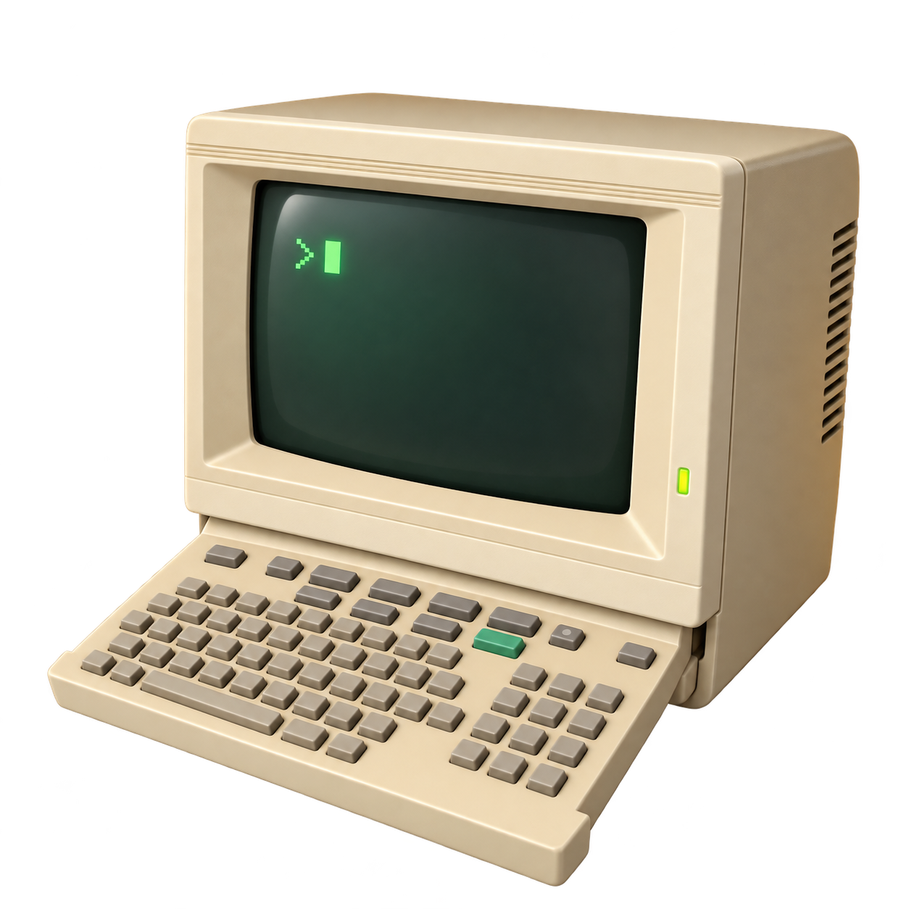
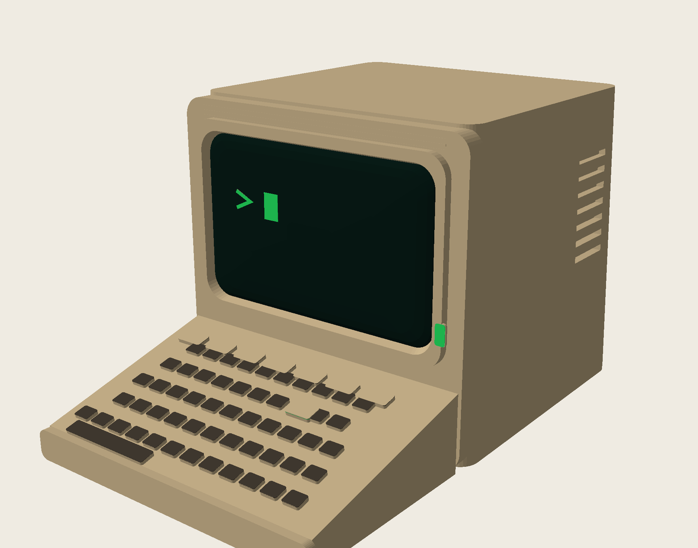
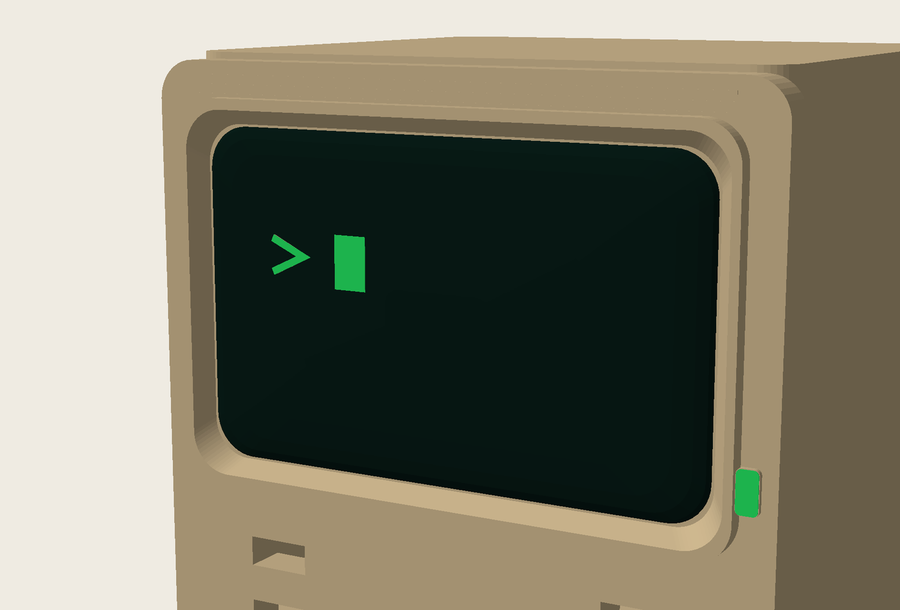
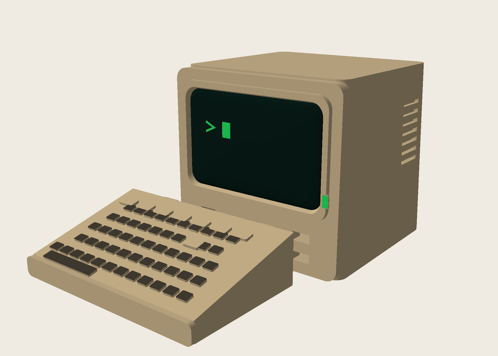
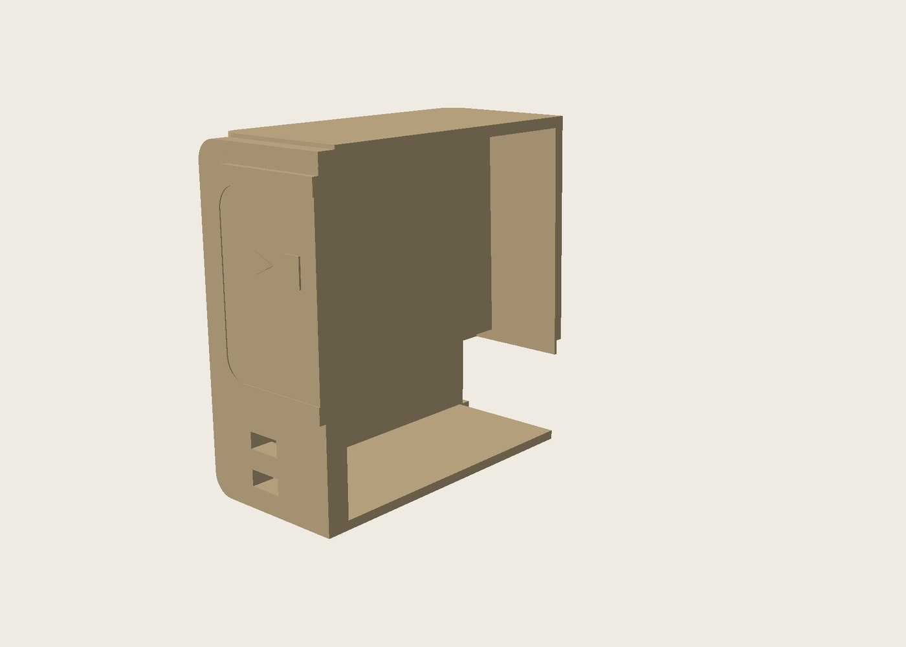
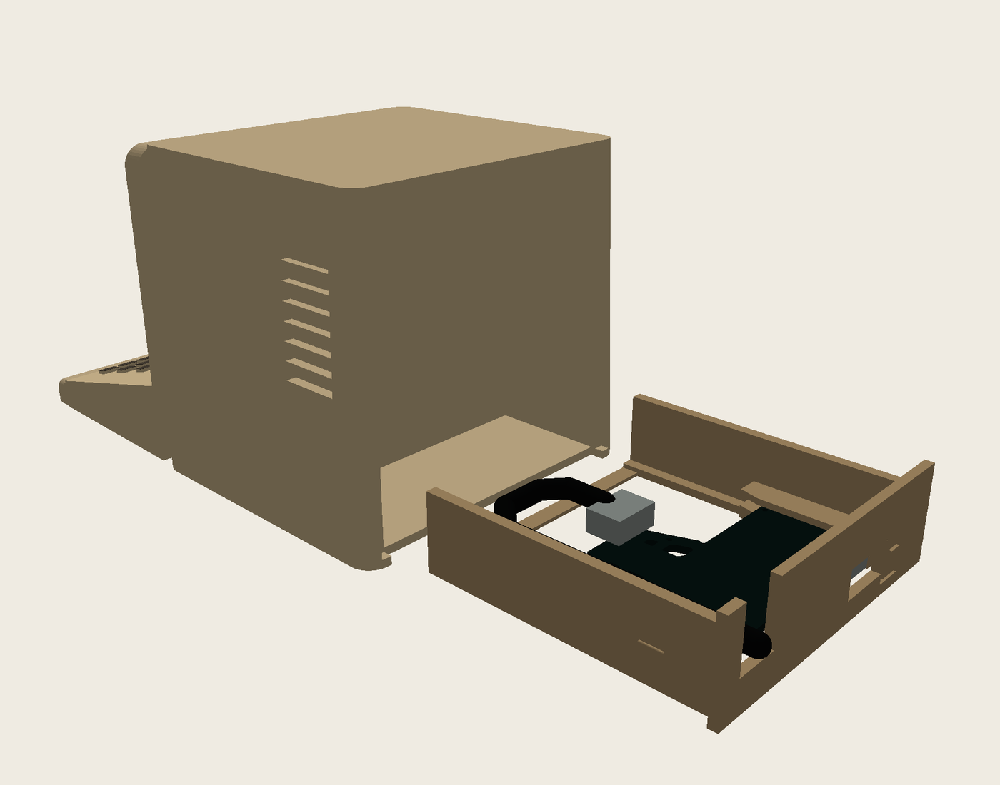
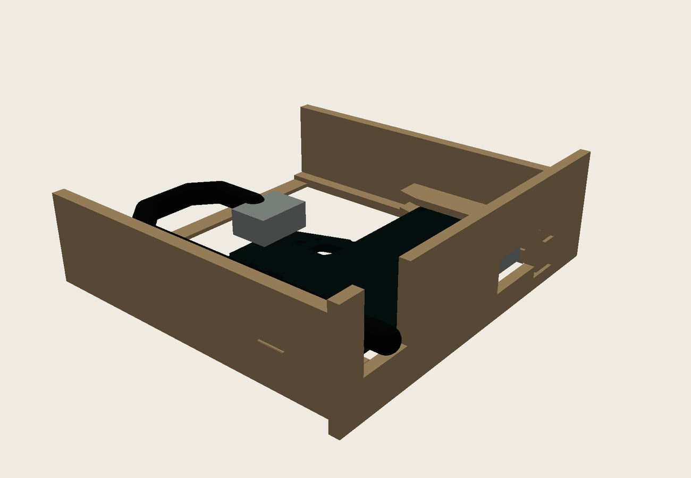
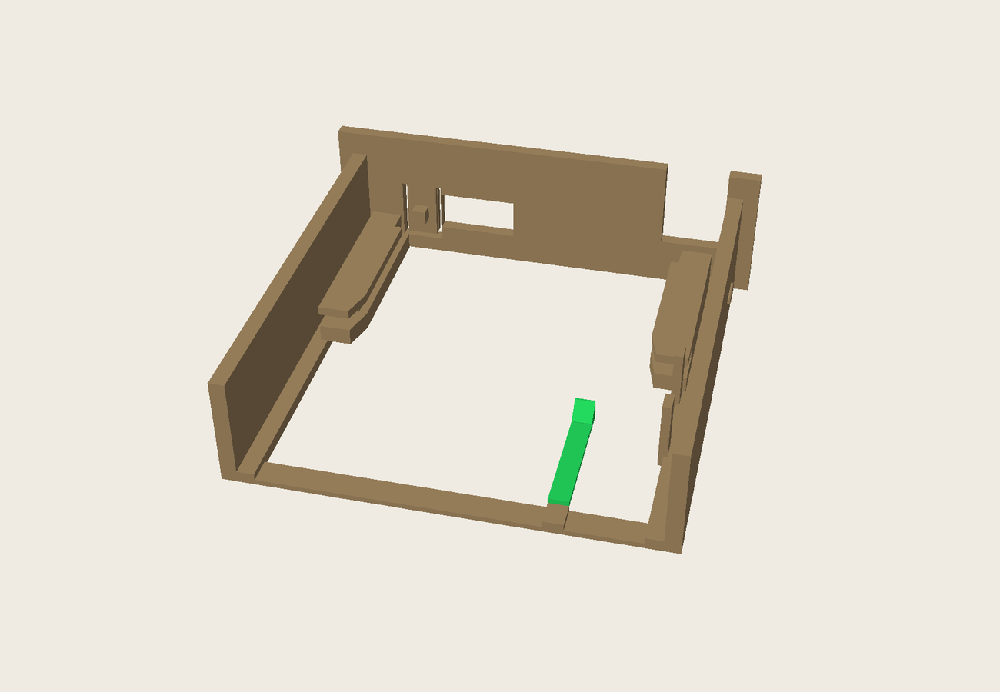

# Mini Minitel ESP32 case

A printable Minitel-shaped enclosure for the
[iodeo ESP Minitel V2](https://github.com/iodeo/Minitel-ESP32) JST cable-to-DIN board.

## Current design: complete three-part v0.5

v0.5 is the complete avatar-inspired miniature Minitel. It prints as three
parts: a hollow cabinet, a separate multicolour keyboard and one removable
ESP32 bay. The external design uses no geometry from the iodeo electronics
enclosure.

Connect JST first, slide the PCB into the bay's edge guides, form the measured
60 mm cable turn and slide the loaded bay into the lower rear of the Minitel.
USB-C and the protruding flexible RESET pad remain accessible at the back. The
DIN plug lays into an open-top notch and never passes through a printed hole.

- [Complete Minitel case STL](stl/v0.5/minitel_case_v0.5.stl)
- [Separate multicolour keyboard STL](stl/v0.5/minitel_keyboard_v0.5.stl)
- [Removable ESP32 bay STL](stl/v0.5/minitel_esp32_bay_v0.5.stl)
- [Dimensions, assembly route, K2 settings and multicolour guide](docs/V0.5-DESIGN.md)
- [Editable OpenSCAD source](src/minitel_v05.scad)

The case is exported flat on its rear. This puts the dark CRT and green
prompt/cursor/lens in the final bounded layers. The keyboard is a separate
flat-bottomed print, so its grey keys and green Enter key do not cause colour
changes throughout the much larger cabinet print.

The CRT face is a shallow compound curve rather than a flat plate. Its centre
bulges forward while the perimeter stays recessed, and the beige inner bezel
funnels inward toward that recessed edge to match the project avatar.

All three parts contain an enclosed `WDTY v0.5` watermark spanning three
0.20 mm layers. The cabinet is a true hollow shell rather than a solid infill
volume. Thin U-guides locate the bay and three permanent 1.2 mm bridge ribs
reduce the rear-down front-wall bridge to 24 mm. The curved CRT backing
overlaps the cabinet by 3.2 mm, so it forms one continuous structure without
a slit.

This remains a mechanical prototype, not a fit-verified release. The revised
bay has a releasable PCB latch, a positive flange shoulder and open guides for
the measured 4.3 mm cable. Those guides are not hard strain relief. Physical
connector positions, latch force and RESET travel still need verification.
See the mechanical audit before printing: a collision-free reference model
alone does not prove physical fit.

## Repository layout

- [`src/`](src/): editable v0.5 OpenSCAD source.
- [`stl/v0.5/`](stl/v0.5/): the three current printable parts.
- [`docs/`](docs/): v0.5 design notes and PCB-reference provenance.
- [`assets/renders/v0.5/`](assets/renders/v0.5/): current CAD renders.
- [`assets/photos/`](assets/photos/): owner-supplied hardware photographs.
- [`reference/`](reference/): PCB inspection mesh and unchanged iodeo references.
- [`tools/`](tools/): Gerber extraction, validation and render scripts.
- [`archive/`](archive/): superseded development files, intentionally omitted
  from this current-version README.

## Editing and exporting

Open [`src/minitel_v05.scad`](src/minitel_v05.scad) in OpenSCAD and select
`case`, `keyboard`, `bay`, `case_assembly` or `assembly` with the `part`
parameter. See the v0.5 design notes for reproducible export, render and
clearance-check commands.

## Attribution and license

Hardware reference: [Louis H./iodeo](https://github.com/iodeo/Minitel-ESP32)
and [Hackaday project](https://hackaday.io/project/180473-minitel-esp32).
This derivative case is licensed under [CC BY-SA 4.0](LICENSE).
Contributions and measured fit reports are welcome.
